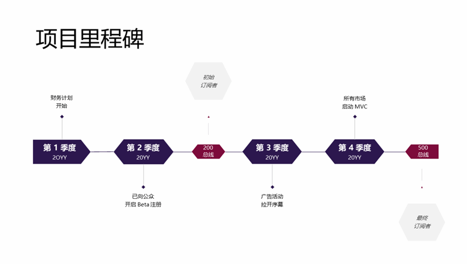
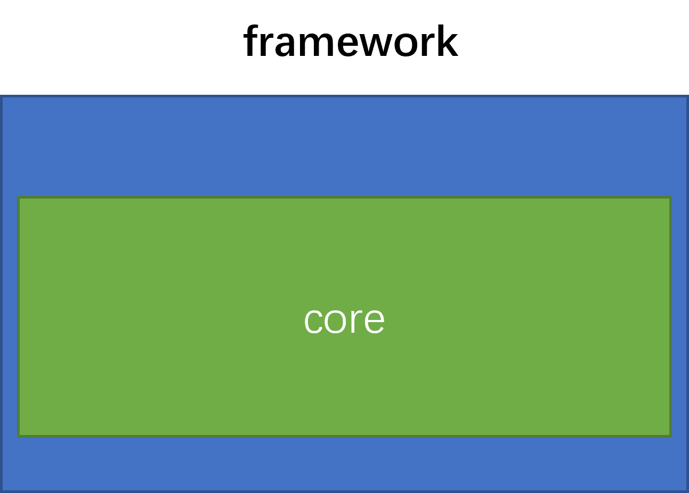

<p align="center">

</p>

<p align="center">


</p>

##  介绍

介绍库或者框架符合的标准，应用领域，解决什么问题。有哪些主要的特点，与同类库相比有哪些优点。

### 特性

- 🚀 特性1

- 🚀 特性2

- 💪 特性3

- 🛠️ 特性4

- 🌍 特性5

- 💡  特性6

### 路线

<p align="center">

</p>
路线图roadmap在 doc/framework-roadmap-logo.pptx 中有源文件。


##  软件架构

### 架构图

<p align="center">

</p>

架构图文字说明，包括模块说明、架构层次等详细说明。

### 源码目录

```shell
.
├── README.md
├── doc
│   ├── assets
│   ├── cjcov
│   ├── design.md
│   ├── proposal.md
│   └── xxx_lib.md
├── src
│   └── Template.cj
└── test
    ├── HLT
    ├── LLT
    └── UT
```

- `doc` 是库的设计文档、提案、库的使用文档、LLT 用例覆盖报告（小于 90%，在此说明）
- `src` 是库源码目录
- `test` 是存放测试用例，包括 HLT 用例、LLT 用例和 UT 用例

### 接口说明

主要是核心类和成员函数说明

#### class xxx

##### func yyy

成员函数功能描述

```cangjie
func yyy(): Unit
```

##### func zzz

成员函数功能描述

```cangjie
func zzz(): Unit
```

#### class xxx

##### func yyy

成员函数功能描述

```cangjie
func yyy(): Unit
```

##### func zzz

成员函数功能描述

```cangjie
func zzz(): Unit
```

#### func xxxx

Top level函数功能描述

```cangjie
func xxxx(): Unit
```

##  编译执行

### 编译

编译描述和具体shell命令

```shell
cpm update
cpm build
```

### xx示例

示例描述

```cangjie
import xxx.*

```

执行结果如下：

```shell
xxx
```
##  参与贡献

主要写参与贡献的人以及个人主页链接

[@chinesebear](https://gitee.com/chinesebear)