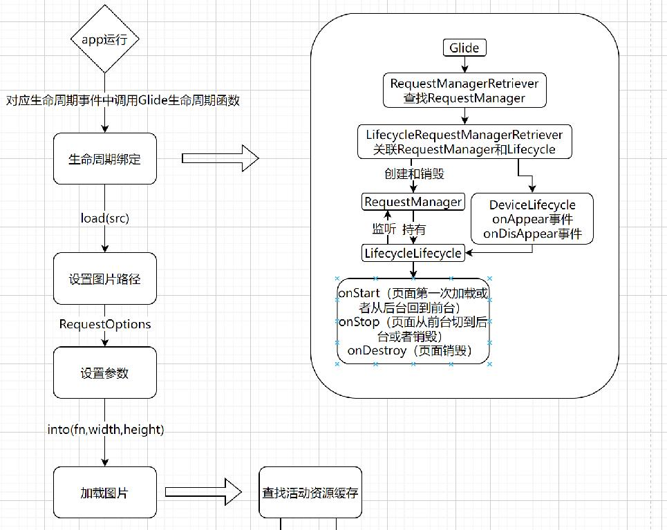
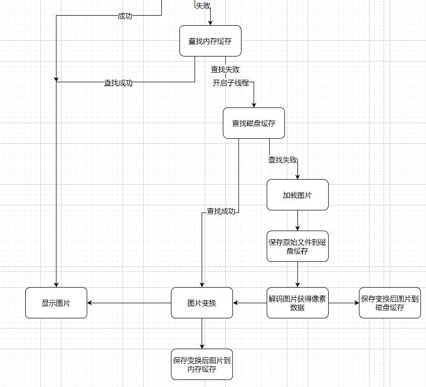

<div align="center">
<h1>droplet</h1>
</div>

<p align="center">


</p>

## 介绍

droplet是一个图像加载缓存库，致力于更高效、更轻便、更简单得加载图片。在图片列表滚动时候实现平滑滚动得效果。


### 特性

- 🚀 支持生命周期管理。

- 🚀 支持静态图像加载。

- 💪 支持设置加载中和加载失败图片以及压缩图。

- 🛠️ 加载 gif 图片资源。

- 🌍 支持三级缓存策略。

- 🚀 支持transform图像变换效果

- 🚀 支持自定义组件的形式加载图片


## 软件架构

### 架构图

<p align="center">


</p>

架构图文字说明，包括模块说明、架构层次等详细说明。

### 源码目录

```shell
├── README.md                                 #整体介绍
├── doc                                       #文档目录
│   ├── assets                                #文档资源目录
│   └── feature_api.md                        #API接口文档
├── cjdroplet                                 #源码目录 
└── entry                                     #测试用例目录
```

### 接口说明

主要类和函数接口说明详见 [API](./doc/feature_api.md)


## 使用说明

### 编译构建

描述具体的编译过程：

```shell
    第一步.由于该库的transform依赖C的代码，因此首先要用cjdroplet/cpp下的C代码编译成so
      编译方法，新建一个仓颉UI项目，然后在entry/src/main/下面建一个文件夹，这个文件夹是和cangjie文件夹平级的，给他取一个名字比如cjglideOpenGl,然后把刚才的
      C代码，放入这个文件夹，
      然后看新建项目的entry下面的build-profile.json5,在buildOption层级下加上这个
      "externalNativeOptions": {
       "path":"./src/main/cjglideOpenGl/CMakeLists.txt",
       "arguments": "",
       "cppFlags": "",
       "abiFilters": [
         "arm64-v8a",
         "armeabi-v7a"
       ]
      }
      这个代码和cangjieOptions平级，其中的path路径就是刚新建的目录的下面的CMakeLists.txt
      注意，还有一个细节在entry/src/main/下面要建一个cpp名字的文件夹，没有的话可能编译so会失败
      接下来点击deveco的build菜单下的Build Haps/Apps 里的Build Haps 
      构建结束后，最后，会在entry/build/default/intermediates/cmake/default/obj/里面找到arm64-v8a这个文件夹，里面有libc++_shared.so libglwrapper.so两个文件
      其中的libglwrapper.so就是我们需要的so，注意libglwrapper这个名字跟你CMakeLists.txt里面的定义有关
    
    第二步
     在得到第一步的so之后，我们把这个so放入我们项目下的cjdroplet/libs里面即可
     然后在cjdroplet/src/main/cangjie/cjpm.toml里面添加
     [ffi.c]
        glwrapper.path = "../../../libs"     
    其中glwrapper是so的名字，如果你修改了c代码改了名字，要在这里同步修改，后面那个路径就是根据cjpm.toml的相对路径
    
    最后
       点击Build菜单下的Rebuild Project就能把项目编译成功 
```

### 功能示例

#### 网络图片加载 功能示例
功能示例描述: 加载一个网络图片，支持的图片类型为：bmp、jpg、png、wbep。

示例代码如下：

```cangjie
from ohos import base.*
from ohos import component.*
from ohos import state_manage.*
from ohos import state_macro_manage.*
from cj_res import default.*

from net import http.*
from std import socket.*
from net import tls.*
from std import io.*
from encoding import url.*
from std import fs.*
from std import time.*

import glide.engine.cache.disk_lru_cache.Entry as DisLruEntry
import glide.engine.cache.memory_cache.Entry as LruEntry

import zujianbao.*
import glide.*
import glide.add.*
import glide.request.*
import glide.executor.*
import glide.util.utils.*

import glide.request_options.*
import glide.util.pool.*
import glide.load.*
import glide.util.*
import glide.util.calculator.*
import glide.engine.cache.memory_cache.*


@Entry
@Component
class MyView {

	@State var text: String = ""

    @State var textTmp: String = ""


    @State
    var option: GlideRequestOption = GlideRequestOption (
        // 加载一张本地的jpg资源（必选）
        loadSrc: Option<String>.Some("https://pic.leetcode-cn.com/1614477066-YeEeWg-file_1614477068523"),    // bmp
        //loadSrc: "/data/storage/el1/bundle/testjpg.jpg",    // jpg
        //loadSrc: "/data/storage/el1/bundle/testpng.png",    // png
        //loadSrc: "/data/storage/el1/bundle/testwebp.webp",  // wbep
        //loadSrc: "/data/storage/el1/bundle/test.gif",       // gif

        placeholder: Option<CJResource>.Some(@r(app.media.loading)),             // 占位图使用本地资源icon_loading（可选）
        errholder: Option<CJResource>.Some(@r(app.media.img)),                     // 失败占位图使用本地资源icon_failed（可选）
        strategy: Option<DiskCacheStrategy>.Some(DiskCacheStrategyDATA()),                // 磁盘缓存策略（可选）
        label: Option<String>.Some("page")                                         // 生命周期标签
    )

    public func onAppear(): Unit {
        AppLog.error("调了onAppear1--------------------------------------------------------------------GlideImage")
        Glide.get(globalAbilityContext.getOrThrow()).onAppear(option.label)
    }
    public func onDisappear(): Unit {
        AppLog.error("调了onDisAppear1--------------------------------------------------------------------GlideImage")
        Glide.get(globalAbilityContext.getOrThrow()).onDisAppear(option.label)
    }

    func render() {
        Column(30) {
            Column() {
                GlideImageZJ(globalContext:globalAbilityContext,option: option, beginFn: {=> text = "begin";AppLog.error("glide hhs begin")}, endFn: {=> textTmp = "end";AppLog.error("glide hhs end")})
            }.width(100.percent)
        }
    }

}


```

执行结果如下：
图片在手机上成功展示。

```shell
load成功
```


## 约束与限制

当前基于 OpenHarmony Cangjie Mobile1.1.0.B033 版本实现的

1.暂未支持过渡动画


## 开源协议

本项目基于 [Google License](./LICENSE) ，请自由的享受和参与开源。

## 参与贡献

欢迎给我们提交PR，欢迎给我们提交Issue，欢迎参与任何形式的贡献。