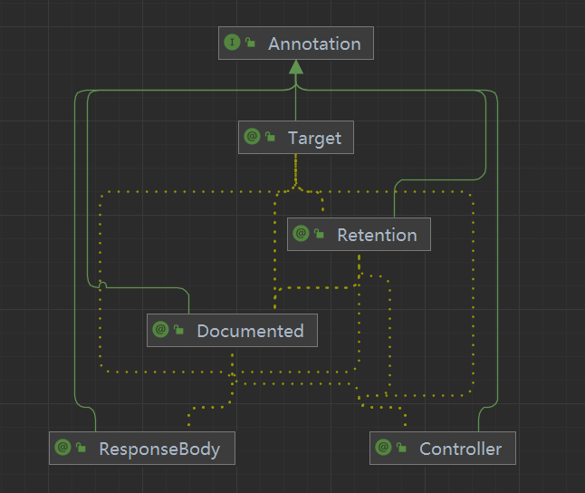

# 库 / 模块 / 类设计介绍

## 🚀 描述
    设计文档的描述。

## 🚀 class A design API

### 💡 类描述
    设计类描述
### 💡 类API
```cangjie

// enum API
public enum B {
    | case1
    | case2
}

// struct API
public struct S {
    public func aa(): Unit
    public func xx(): Unit
    public func cc(): Unit
}

// class API
public class AA {
    public func aa(): Unit 
    public func bb(): String 
    public func cc(arg: Int64): Unit 
    public func dd(arg: Bool): Unit 
    public static func ee(): Unit 
    public static func ff(arg: String): Unit 
}

// function API
public func abc () : Unit
public func def () : Bool

```

## 🚀 架构图

### 💡 依赖关系



### 💡 架构图设计描述
```cangjie
// 架构图设计原理
// It can be pictures, text, or UML....
```


## 🚀 展示示例

```cangjie
// demo No.1
from std import xxx.*

main () {
    ...
}
```

```cangjie
// demo No.2
from std import xxx.*

main () {
    ...
}

```